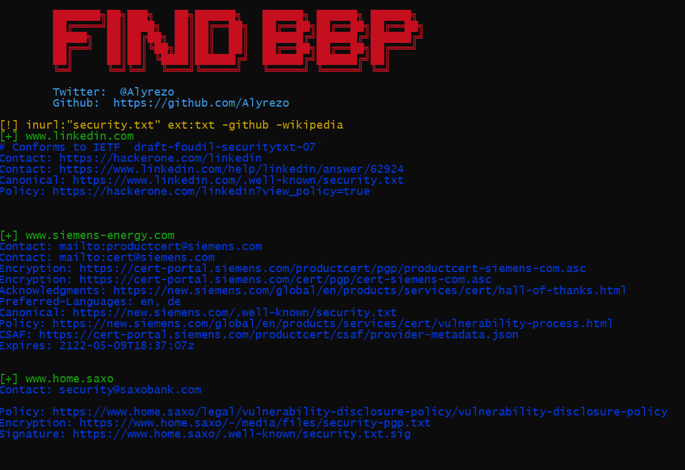
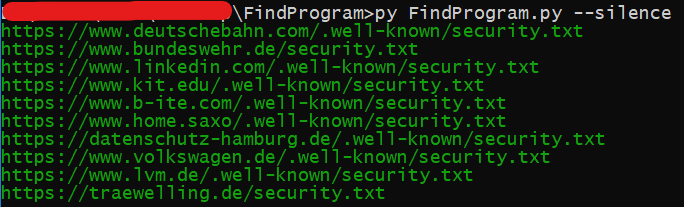
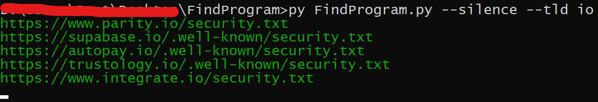
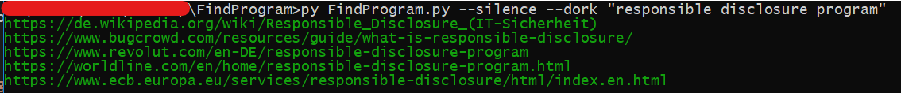

<h1 align="center">
  Find BBP
  <br>
</h1>

<p align="center">
  <a href="#features">Features</a> •
  <a href="#installation">Installation</a> •
  <a href="#usage">Usage</a> •
  <a href="#running">Running</a> •
  <a href="#license">License</a>
</p>

---

Find Bug Bounty Program In short Find BBP is a google crawler and tool that discovers bug Bounty Program via security.txt file by default and you can use custom dork

# Features

<h1 align="left">
  </a>
  <br>
</h1>

- Fast and powerful
- Find private program
- use custom dork
- output export as txt file
- sort tld domains

# Installation

Find BBP requires **python3** to install successfully. Run the following command to install:

- ```git clone https://github.com/alyrezo/FindBBP```
- ```cd FindBBP ```
- ``` python -m pip install -r lib.txt```
- ```py FindProgram.py```

# Usage

```sh
py FindProgram.py -h
```
This will display help for the tool. Here are all the switches it supports.

```yaml
usage: FindProgram.py [-h] [--silence] [-d DORK] [-o OUTPUT] [-c COUNT] [-t TLD]

optional arguments:
  -h, --help            show this help message and exit
  --silence             Not displaying the banner
  -d , --dork           for using your custom dork
  -o , --output         result export as txt file
  -c , --count          count of domains it finds
  -t , --tld            for sort Top-Level Domain

```

# Running

To run the tool, just use the following command.

```sh
py FindProgram.py 
```
<h1 align="left">
  </a>
  <br>
</h1>

```sh
py FindProgram.py --silence --count 10 --output url.txt
```
<h1 align="left">
  </a>
  <br>
</h1>

```sh
py FindProgram.py --silence --tld io
```
<h1 align="left">
  </a>
  <br>
</h1>

```sh
py FindProgram.py --silence --dork "responsible disclosure program"
```
<h1 align="left">
  </a>
  <br>
</h1>

# License
`Find BBP` is made with 💚 by the [alyrezo](https://Twitter.com/alyrezo)
